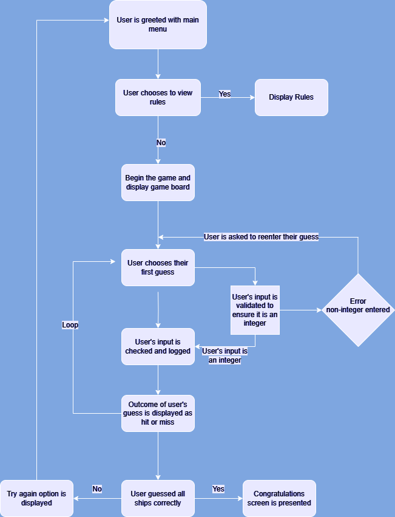

# Battleship

## Contents

* [User Experience](#user-experience-ux)
  * [User Stories](#user-stories)

* [Design](#design)
  * [Flowchart](#flowchart)

* [How To Play](#how-to-play)

* [Features](#features)
  * [Future Implementations](#future-implementations)

* [Technologies Used](#technologies-used)

* [Deployment & Local Deployment](#deployment--local-development)

* [Testing](#testing)

* [Credits](#credits)

## User Experience (UX) 

### Initial Discussion

This program will replicate the classic strategy game Battleship by allowing the user to try and guess the locations of the computer's ships and take them out. 

#### User Goals
 - I want the user to be able to easily play a game of Battleship by guessing the location of the various boats. 
 - I want the rules to be easily accessible for first time players. 

## Design

#### Flowchart

## How to play

Starship Fighters plays out the same way as the classic 'Battleship', at the main menu the user can choose to start game, display rules or leave the game. Upon beginning the game a set of randomly generated ships wll be printed to the screen for the user with ships marked as "S" and a hidden set for the computer, as well as this a blank board will be printed for the user to use as a reference for their guesses. 

During the users turn they will be asked to choose a number ranging from 1-5 for their chosen row and then a letter from A-E for their chosen column. Once entered the blank grid will update with either "X" for a hit or "/" for a miss. The same will happen on the board with the user's ships except the "S" will change to "X".

The first to reach a score of five will win the game and the user will be given an option to play again. 

## Features

#### Future Implementations

## Technologies Used

## Deployment

## Testing

## Credits

