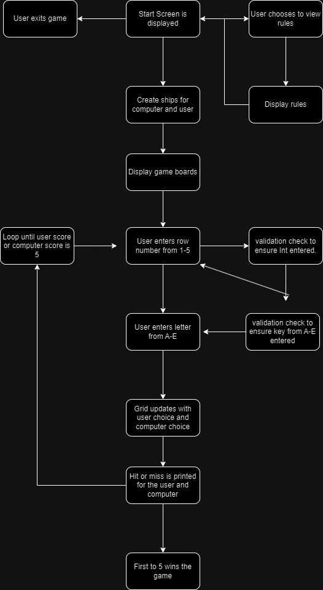
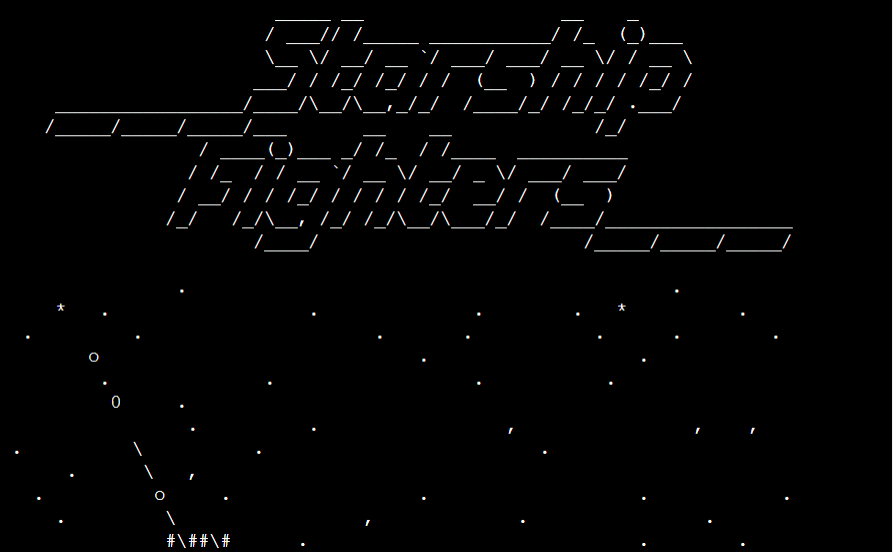
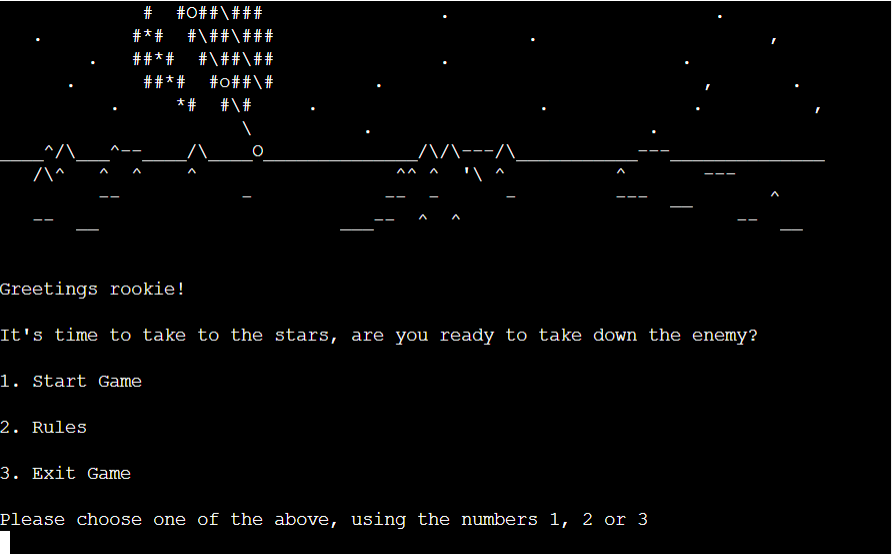
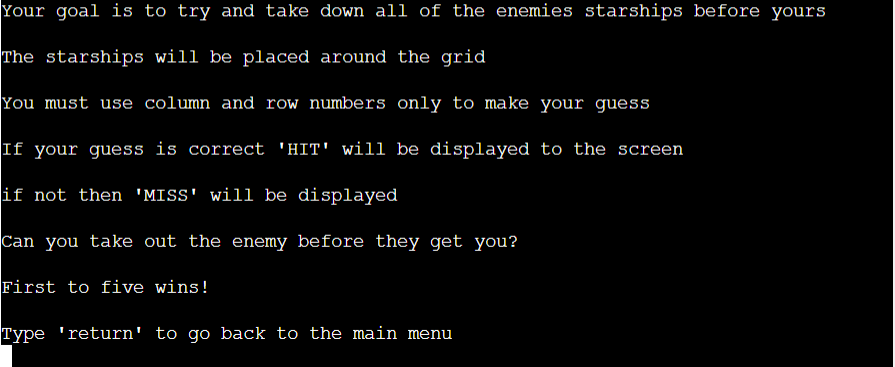
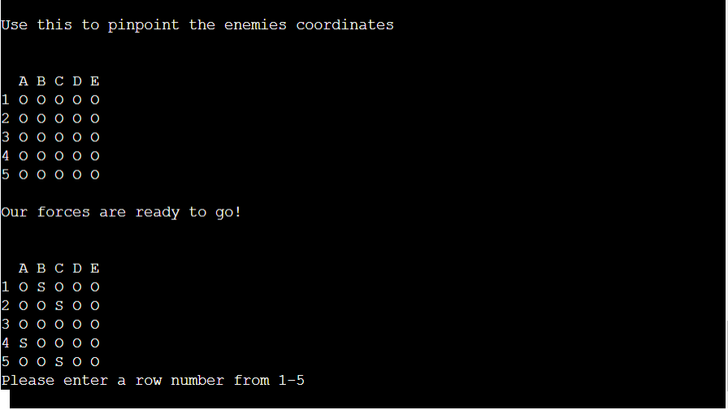
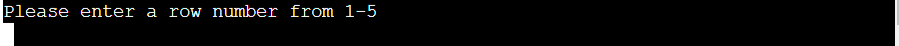
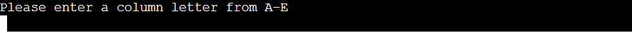
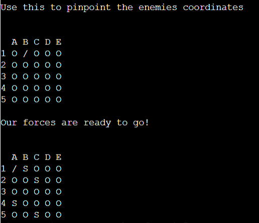
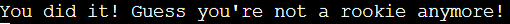

# Battleship

## Contents

* [User Experience](#user-experience-ux)
  * [User Stories](#user-stories)

* [Design](#design)
  * [Flowchart](#flowchart)

* [How To Play](#how-to-play)

* [Features](#features)
  * [Future Implementations](#future-implementations)

* [Technologies Used](#technologies-used)

* [Deployment & Local Deployment](#deployment--local-development)

* [Testing](#testing)

* [Credits](#credits)

## User Experience (UX) 

### Initial Discussion

This program will replicate the classic strategy game Battleship by allowing the user to try and guess the locations of the computer's ships and take them out. 

#### User Goals
 - I want the user to be able to easily play a game of Battleship by guessing the location of the various boats. 
 - I want the rules to be easily accessible for first time players. 

## Design

#### Flowchart

## How to play

Starship Fighters plays out the same way as the classic 'Battleship', at the main menu the user can choose to start game, display rules or leave the game. Upon beginning the game a set of randomly generated ships wll be printed to the screen for the user with ships marked as "S" and a hidden set for the computer, as well as this a blank board will be printed for the user to use as a reference for their guesses. 

During the users turn they will be asked to choose a number ranging from 1-5 for their chosen row and then a letter from A-E for their chosen column. Once entered the blank grid will update with either "X" for a hit or "/" for a miss. The same will happen on the board with the user's ships except the "S" will change to "X".

The first to reach a score of five will win the game and the user will be given an option to play again. 

## Features

### Start Screen

At the beginning of the game the user will be presented with the logo for "Starship Fighters" along with a space background, below this will be a menu allowing them to choose one of the following:

 1. Start Game
 2. Display Rules
 3. Exit Game

 
 

### Display Rules

If the user enters '2' as their choice the rules will be displayed. 

### Start Game

If the user enters '1' as their choice the game will begin and both boards will be printed to the screen.

### Choosing Row

User is asked to enter a number from 1-5 for their choice of row.

### Choosing Column

User is asked to enter a letter from A-E for their choice of row. The game will convert the letter an Int for validation and and check with computer's hidden ships.

### Grids Updated

After the input from user has been taken and validated the grids for both the user's guesses and the user's ships are updated to reflect if they were hit or not. 

In this instance both myself and the computer missed.

### User Wins

User wins the game

### Computer Wins

#### Future Implementations

In future I would like to add a turn count for the user and computer maybe as a difficulty option as you can keep guessing till the board is filled. 

I would also like the option to display both scores and possibly a high score option using a Google Sheets. 

## Technologies Used

### Languages and Python Packages/Libraries Used

- [Python](https://www.python.org/) 

- [Random](https://www.w3schools.com/python/module_random.asp)
    - Random was used to generate the user's ships and computer ships at the beginning of the game. 

### Frameworks and Programs Used

- #### [Visual Studio Code](https://code.visualstudio.com/)
The entirety of the site was coded using Visual Studio Code.

- #### [GitHub](https://github.com/)
    - GitHub was used to store code online and serves a source for Heroku 

- #### [Heroku](https://dashboard.heroku.com/login)
    - This was used to deploy my Python Terminal online once it was linked to the Repo.

## Deployment

In order to deploy the final build of my project online I used Heroku. This was done by the following: 

1. Push my latest code to GitHub.
2. Go to Heroku
3. Create new app.
4. Enter my application name and choose Europe for region.
5. Search for my Repo
6. Select connect to the relevant repo you want to deploy.
7. Go to the settings tab.
8. Add buildpack
9. Select Python, then save changes.
10. Select Nodejs, then save changes.
11. Ensure that Heroku/Python is at the top of the list, followed by Heroku/Nodejs
12. Go to the deploy tab
13. Scroll down to Manual Deploy and select deploy branch.

## Testing

## Credits

