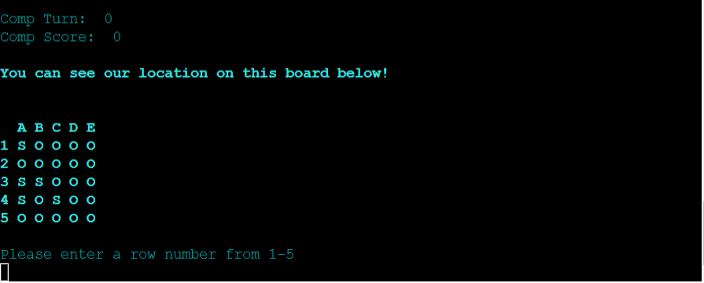

# Starship Fighters

## Contents

* [User Experience](#user-experience-ux)
  * [User Stories](#user-stories)

* [Design](#design)
  * [Flowchart](#flowchart)

* [How To Play](#how-to-play)

* [Features](#features)
  * [Future Implementations](#future-implementations)

* [Technologies Used](#technologies-used)

* [Deployment & Local Deployment](#deployment--local-development)

* [Testing](#testing)

* [Credits](#credits)

## User Experience (UX) 

### Initial Discussion

This program will replicate the classic strategy game Battleship by allowing the user to try and guess the locations of the computer's ships and take them out. 

#### User Goals
 - I want the user to be able to easily play a game of Battleship by guessing the location of the various boats. 
 - I want the rules to be easily accessible for first time players. 
 - I want the user to be able to see how many turns it took to win/lose.

## Design

#### Flowchart

## How to play

Starship Fighters plays out the same way as the classic 'Battleship', at the main menu the user can choose to start game, display rules or leave the game. Upon beginning the game a set of randomly generated ships wll be printed to the screen for the user with ships marked as "S" and a hidden set for the computer, as well as this a blank board will be printed for the user to use as a reference for their guesses. 

During the users turn they will be asked to choose a number ranging from 1-5 for their chosen row and then a letter from A-E for their chosen column. Once entered the blank grid will update with either "X" for a hit or "/" for a miss. The same will happen on the board with the user's ships except the "S" will change to "X".

The first to reach a score of five will win the game and the user will be given an option to play again. 

Live version of game can be found here:
[Starship Figters](https://starship-fighters-1c920d04c48c.herokuapp.com/)

## Features

### Start Screen

At the beginning of the game the user will be presented with the logo for "Starship Fighters" along with a space background, below this will be a menu allowing them to choose one of the following:

 1. Start Game
 2. Display Rules
 3. Exit Game

 
 

### Display Rules

If the user enters '2' as their choice the rules will be displayed. 

### Start Game

If the user enters '1' as their choice the game will begin and both boards will be printed to the screen.

### Choosing Row

User is asked to enter a number from 1-5 for their choice of row.

### Choosing Column

User is asked to enter a letter from A-E for their choice of row. The game will convert the letter an Int for validation and and check with computer's hidden ships.

### Same Input

If the user inputs a location that has previously been used the following is displayed. 

### Grids Updated

After the input from user has been taken and validated the grids for both the user's guesses and the user's ships are updated to reflect if they were hit or not. 

In this instance both myself and the computer missed.

### Turn and Score Counter

### User Wins

User wins the game

#### Turn Count

### Computer Wins

### Play Again

Prompt for user to play again

#### Future Implementations

In future implementations I would like to add difficulty options such as board sizes or a turn limiter. 

I would like to add the option for the user to choose the colour for their board and the enemies board for more customistion. 

## Technologies Used

### Languages and Python Packages/Libraries Used

- [Python](https://www.python.org/) 

- [Random](https://www.w3schools.com/python/module_random.asp) was used to generate the user's ships and computer ships at the beginning of the game.
- [Colorama](https://pypi.org/project/colorama/) was used to add colours to user facing terminal. 
- [PyFiglet](https://pypi.org/project/pyfiglet/) was used to create the Starship Fighters logo rather than pasting in ASCII art for it. 

### Frameworks and Programs Used

- #### [Visual Studio Code](https://code.visualstudio.com/)
The entirety of the site was coded using Visual Studio Code.

- #### [GitHub](https://github.com/)
    - GitHub was used to store code online and serves a source for Heroku 

- #### [Heroku](https://dashboard.heroku.com/login)
    - This was used to deploy my Python Terminal online once it was linked to the Repo.

- #### [Draw.io](https://app.diagrams.net/)
    - Draw.io was used to create the flowchart for Starship Fighters

## Deployment

In order to deploy the final build of my project online I used Heroku. This was done by the following: 

1. Push my latest code to GitHub.
2. Go to Heroku
3. Create new app.
4. Enter my application name and choose Europe for region.
5. Search for my Repo
6. Select connect to the relevant repo you want to deploy.
7. Go to the settings tab.
8. Add buildpack
9. Select Python, then save changes.
10. Select Nodejs, then save changes.
11. Ensure that Heroku/Python is at the top of the list, followed by Heroku/Nodejs
12. Go to the deploy tab
13. Scroll down to Manual Deploy and select deploy branch.

## Testing

All of the code within this program was tested using Code Institute's PEP8. When first run there were errors based around lines being too long, and trailing whitespaces. 

This was corrected using Flake8 extension and Black, the are some remaining errors but these are coming from the ASCII art used for the start screen.

### Validation Checks

To ensure the correct inputs are given throughout the program validation testing was used.

For example within the function for taking the user's row and column inputs a ValueError check is used to ensure that only an Int value is entered. For the columns a KeyError is used to ensure letters only when choose a column.

### Manual Testing

| Feature Tested  | Outcome  | Test Performed  | Result  | /Fail  |
|---|---|---|---|---|
| `Menu Navigation`  |   |   |   |   |
| Start Game  |  User should be able to start the game when selecting this option  | Enter '1' into the input | Game begins  | Pass  |
|  Display Rules |  User should be able to view the rules when selecting this option  | Enter '2' into the input | Rules are displayed  | Pass  |
| Exit Game |  User should be able to exit the game when selecting this option  | Enter '3' into the input | Game ends  | Pass  |
|  `Game Boards` |   |   |   |   |
|  Game Boards are created | When the game begins two boards should be displayed, one for user to make guesses and user's ship location  | Begin game  | Two game boards are displayed to the user  | Pass |
| `Play Game`   |   |   |   |   |
|  Row Input | User can enter a number from 1-5  | Enter '4'  | Game board updates to reflect choice  | Pass  |
| Col Input  | User can enter a letter from A-E  | Enter 'C'  | Game board updates to reflect choice  | Pass  |
|  Row Input - incorrect |  Enter something other than number 1-5 | Enter '6'  | Error displays and user is prompted to enter a number from 1-5  | Pass  |
| Col Input - incorrect  | Enter something other than letter A-E  | Enter 'F'  | Error displays and user is prompted to enter a letter from A-E | Pass  |
|  User Turn Update | When a user takes their turn the counter should update  | Guess a row and col  | Turn counter updated to '1'  | Pass  |
| Comp Turn Update | After a user takes their turn the computer should take theirs and counter update | Take a turn  | Computer turn counter updated  | Pass  |
|  User Score Update | Should update when a ship has been hit  | Correctly guess a location | Score updated  | Pass |
| Comp Score Update | Should update when a ship has been hit  | Computer correcly guessed a location  | Score updated | Pass  |

### Wrong Inputs

#### Game Menu

#### Wrong Row

#### Wrong Column

## Bugs

### Resolved Bugs

##### Out of Range Error

When entering the letter 'E' the above error was displaying in the terminal. This was caused by Python indexing beginning at 0, by adding -1 to the column input this error was fixed. 

##### KeyValue Error

This error ocurred when trying to validate user's input for column from A-E, this was fixed by changing the error check from ValueError to KeyValue

### Unresolved Bugs

#### Invalid Escape Sequence

Afer I changed added code for PyFiglet to the start menu and a while true loop I started to get the following error. I have checked the code several times but am unable to locate the backslash that is causing the error. 

## Credits

[Battleship Youtube Video](https://www.youtube.com/watch?v=alJH_c9t4zw&t=377s)
 - This video helped with converting the letters to numbers when user enters their input and for further use throughout the game's functions. 

[Stack Overflow](https://stackoverflow.com/questions/2084508/clear-terminal-in-python)
- This post on Stack Overflow forumns was used to create the clear terminal function used to reset the screen upon each input. 

Peer Code Review
- I used Joanne Lee's [Pirate Battleship](https://github.com/lee-joanne/pirate_ship/tree/main) for inspiration in setting up the user turn and computer turn.

## Acknowledgements

Tutor Support
 - I am so grateful to all of the tutors who have assisted with my project especially with the amount of times I need to reach out towards the end as I was reaching the deadline and a big thank you to Joanne for showing me her battleship game.

 - My mentor for their support and feedback throughout the project. 

 - Finally I would like to thank Code Institute for giving me the opportunity to learn these new skills and to create this fun game. 

